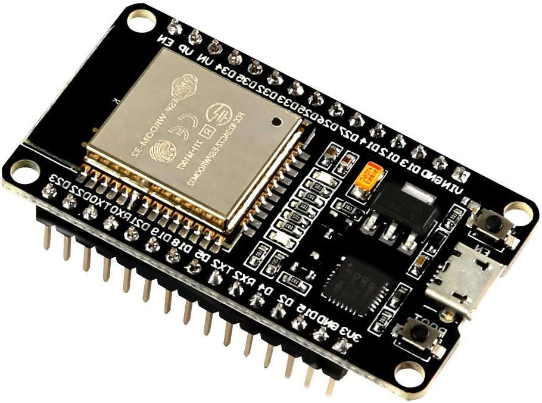
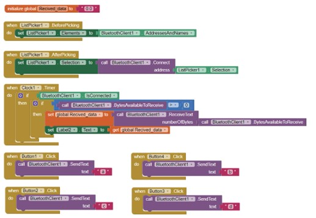
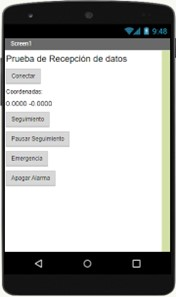

<h1 align ="center"><b>GPS Tracker Using an ESP32 and A9G Module</b></h1>

    

    <h2>Description of proyect</h2>
    

    A real-time tracking device will be implemented using an ESP32 and an A9G gps-gsm module, through C programming for the esp32 implementing the Arduino IDE, while the a9g module will receive its instructions (AT commands) that the esp32 sends it via serial communication, which in turn connects to a mobile application via Bluetooth.

    <h3>ESP32 technical specifications: </h3>
    
• Series: ESP32 DEV KIT V1 
        • USB-Serial Chip: CP2102 
        • Supply Voltage (USB): 5V DC 
        • Input/Output Voltage: 3.3V DC 
        • 5μA power consumption in sleep mode 
        • Digital GPIO Pins: 24 (Some pins only as input) 
        • Digital Analog Converter: Two 12-bit SAR type ADC, supports measurements in up to 18 channels, some pins support an amplifier with programmable gain
        • Antenna on PCB 
        • Type: Wifi + Bluetooth Module 
        • Wifi: 802.11 b/g/n/e/i (802.11n @ 2.4 GHz up to 150 Mbit/s) 
        • Bluetooth: 4.2 BR/EDR BLE Dual control mode 
        • Main CPU: Tensilica Xtensa 32-bit LX6 
        • Memory: 448 KByte ROM, 520 KByte SRAM, 6 KByte SRAM in RTC and QSPI supports multiple flash /SRAM chips 
        • Secondary processor: Allows basic operations to be performed in ultra-low power mode 
        • Performance: Up to 600 DMIPS 
        • Clock Frequency: up to 240Mhz 
        • Security: IEEE 802.11, including WFA, WPA/WPA2 and WAPI 
        • Hardware accelerated cryptography: AES, SHA-2, RSA, Elliptic Curve Cryptography (ECC), Random Number Generator (RNG) 
    

    <h3>A9G Module technical specifications: </h3>
    

        • USB power voltage: 5V DC 
        • VBAT supply voltage: 3.8 ~ 4.2V DC 
        • I/O voltage: 2.8 VDC 
        • Stand-by current less than 2mA 
        • Plate model: PUDDING A9G-DEV 
        • Main Module (SoM): Ai-Thinker A9G 
        • CPU Chip(SoC): RDA8955L (RISC 32 bit) 
        • GSM/GPRS Chip: RDA6625E 
        • GPS/GNSS Chip: GK9501 
        • GSM/GPRS IPEX-1 antenna connector 
        • IPEX-1 GPS antenna connector 
        • Includes GSM antenna and GPS antenna 
        • On-board microphone 
        • Power management unit: Lithium battery charge management, integrated DC-DC and LDO, variable IO voltage 
        • Micro-SIM card socket 
        • Socket for MicroSD Card 
        • Power button and Reset button 
        • Indicator LEDs on board 
        • Working temperature: -30° to +80°C 
        • Dimensions: 41*22*5mm 
        • Weight: 23 grams 
    
 
    
Both modules are manufactured by the company Ai-Thinker, a Chinese company specialized in the manufacture of this type of modules with applications for IoT and wireless connections.  
    Knowing the characteristics of each module, the programming environment was decided for each one. On the ESP32 side we have a wide variety of programming languages. In this case, programming is carried out using the Arduino IDE, and on the ESP32 side, we have a wide variety of programming languages. A9G module is programmed using AT commands, a series of simple commands that allow us to access its main functions, sent serially; The commands implemented in the job were the following:
    
 
    

    <table>
        <tr>
            <th>Comand</th>
            <th>Result</th>
        </tr>
        <tr>
            <td>AT+CNMI = 2,2,0,0,0</td>
            <td>Sets the output or responses of the module on the serial port.</td>
        </tr>
        <tr>
            <td>AT+GPS = 1</td>
            <td>Enable GPS and the indicator LED starts flashing.</td>
        </tr>
        <tr>
            <td>AT+GPS = 0</td>
            <td>Deactivate the GPS, once deactivated the indicator LED turns off.</td>
        </tr>
        <tr>
            <td>AT+LOCATION=1</td>
            <td>Queries and returns location data in the form of latitude and longitude.</td>
        </tr>
        <tr>
            <td>AT+CMGF = 1</td>
            <td>Sets the format of SMS messages, changing them from hexadecimal characters to text strings.</td>
        </tr>
        <tr>
            <td>AT+CMGS=“3xxxxxxxxx”</td>
            <td>With this command you assign the phone number to which you want to send the SMS.</td>
        </tr>
    </table>
    
 

    <h2>Connection diagram</h2>
    
The connections between the modules are actually very simple, since we have to connect the ESP32 to the PC via the USB cable, which will serve as power and to send the code.
    In order to send AT commands, we will use the serial ports of both modules, which are connected as seen in the following image:
    
 
    

  
    
As shown in the image, the TX pin of the ESP32 is connected to the RX pin of the A9G module, and the RX pin of the ESP32 is connected to the TX pin of the A9G module.
    In other words, it is a cross connection that will allow communication between them. 
    In addition, the A9G module must be powered with a 3.8 to 5 volt source, since the ESP32 only has a 3.3V output, it cannot be powered with this same one. Along with this point, another thing to keep in mind is that the grounds must be connected as seen in the image, the black connection.
    

    <h2>Mobile App</h2>
    
The development of a simple mobile application is carried out using the virtual tool 'MIT App Inventor', in order to verify the correct functioning of the implemented codes.
    This application has 5 buttons, the first of them called 'Connect', has the function of opening the tray of nearby Bluetooth devices to establish a connection. Followed by this button we see the information that the device returns to us.  
    Block programming of the test application:
    

    

        
    
 
    

        
Continuing in downward order we have 4 control buttons called 'Tracking', 'Pause Tracking', 'Emergency', and 'Turn off Alarm', these four buttons send a unique character that is identified within the programming of the ESP32 so that they comply its functions.

        
Once the 'Tracking' button is activated, the ESP32 will begin to send the necessary commands to obtain the location data continuously and updating every 2 seconds until the 'Pause Tracking' button is pressed, which pauses the cycle, and leaves the prototype waiting for another indication.

        
In the case of the 'Emergency' button, activate the function that will continuously send text messages to a previously selected mobile number, these messages will send the location data in 2-minute periods, until the 'Turn Off Alarm' button is pressed. ' or responded to with a text message with the character 'A'.

    
 
    

     
    Thank you for reading the repository, I hope it will be of great help to you.
    Don't forget to leave your little star :)

